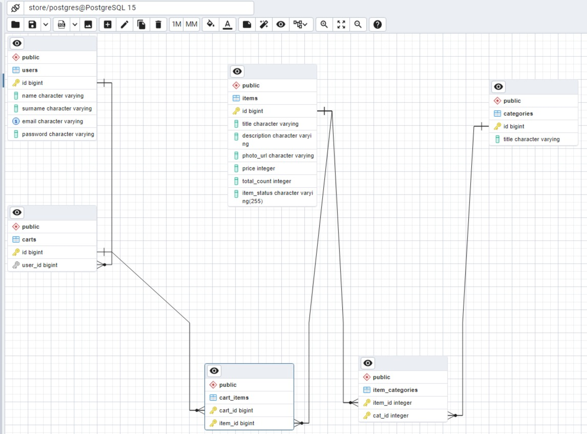

# online-store

## 1. Сборка проекта

1. Запустить приложение в контейнере docker-compose up -d

## 2. Получение и работа с JWT токеном

- Время жизни токена 60 минут
- Для получения - Для получения сделать POST запрос в Postman "http://localhost:8080/registration"

  {
  "name": "Maxim",
  "surname": "Borodulin",
  "email": "Borodulin@mail.ru",
  "password": "12345"
  }

После окончания жизни токена сделать запрос в Postman "http://localhost:8080/login"

      {
       "email": "Borodulin@mail.ru",
       "password": "12345"
      }

- Полученный JWT токен вставляем в header Authorization: Bearer JWT token

## 3. Диаграмма базы данных

## 4. Используемый стек технологий

1. Java 8
2. Spring Data JPA
3. Spring Security
4. Hibernate
5. JWT-api
6. PostgreSQL
7. H2 database(in memory)

## 5. Используемый стек технологий для тестирования

1. Mockito
2. Postman

## 6. Используемые технологии для тестирования

- Docker

## 7. Были написаны проверки для эндпоинтов

1. Открыть папку postman в корневой директории
2. Скачать себе оттуда *.json
3. зайти в postman слева вверху нажать import и выбрать файл
4. Если нет Environments, то создать его.
5. В поле Variable написать JWTTOKEN, type default
6. initial value - вставить JWt токен полученный при авторизации/регистрации

## 8. Порядок проверки эндпоинтов

1. Зарегистрироваться и вставить JWT token(см. выше пункт 4,5,6)
2. Запустить folder Category
3. Запустить folder Item
4. Для просмотра результата вручную запускать каждый эндпоинт в папке Catalog
5. Для просмотра результата работы корзины, так же вручную проверить эндпоинты

